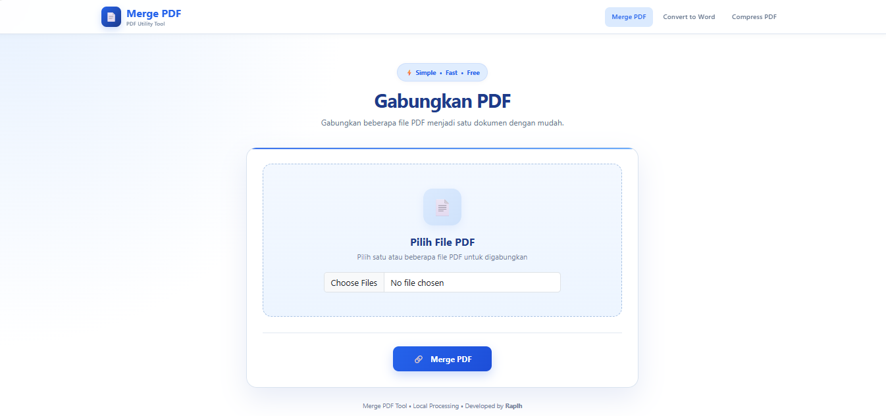
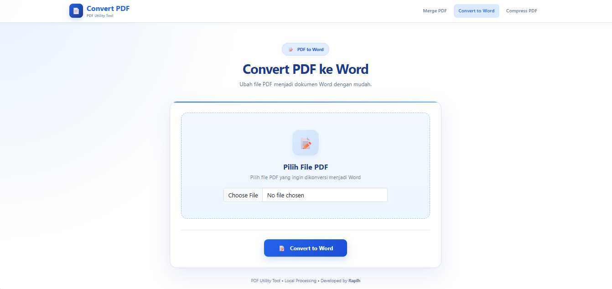
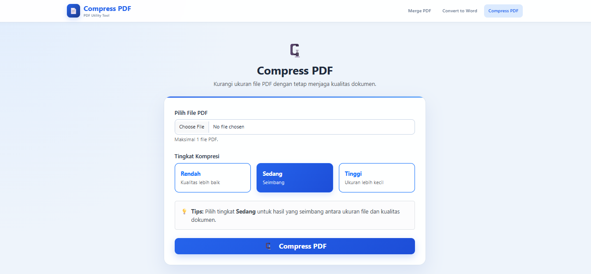

## Features

### 📎 Merge PDF

Menggabungkan beberapa file PDF menjadi satu dokumen dengan mudah.

### 📝 Convert PDF to Word

Mengubah file PDF menjadi dokumen Word yang dapat diedit.

### 🗜️ Compress PDF

Mengurangi ukuran file PDF dengan beberapa pilihan tingkat kompresi.

## Tech Stack

PHP, Bootstrap, Composer, FPDI, PHPWord, Smalot PDF Parser, dan Ghostscript.

## Usage

Aplikasi ini dibuat khusus untuk penggunaan lokal dan tidak ditujukan sebagai layanan pemrosesan PDF secara online.

Seluruh proses dilakukan di lingkungan lokal menggunakan XAMPP dan Apache, sehingga file PDF yang diproses tidak perlu diunggah ke layanan pihak ketiga. Pendekatan ini ditujukan untuk membantu menjaga privasi dan keamanan dokumen pengguna.

Tidak memerlukan database.

## Disclaimer

Project ini dibuat untuk penggunaan pribadi dan edukasi. Pastikan lingkungan komputer yang menjalankan aplikasi tetap aman dan terlindungi.
